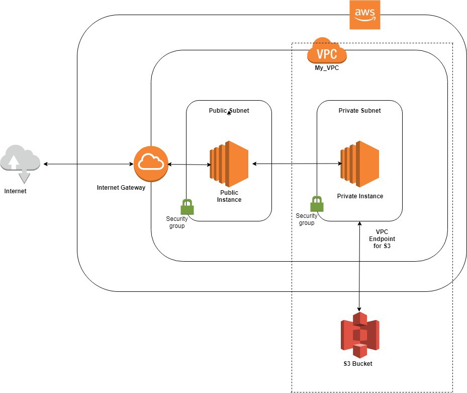

# VPC Endpoint for Amazon S3
The purpose here is to write code in terraform that will provision an infrastructure as shown in the diagram below. It is made up of:
- A VPC that has one private and one public subnet
  - Only the public instance has access to internet. This instance acts as a jump box to the private instance
  - The private instance does not have access to internet. This instance connects to S3 via a VPC Endpoint
- VPC Endpoint provides private access to S3. Traffic between private instance and S3:
  - does not go through open internet
  - does not leave Amazon network



VPC Endpoint for S3 is a helpful feature that privately connects your VPC to S3. A private connection from your VPC to your AWS services is a much more secure way compared to giving internet access to your instances or using a NAT device.

[VPC Endpoint for Amazon S3](https://aws.amazon.com/blogs/aws/new-vpc-endpoint-for-amazon-s3/) blog explains how to create an Endpoint via AWS Management Console


# Prerequisites
- Terraform v0.12.3 _(Code has been tested with this version)_
- Create an RSA key (i.e. ~/.ssh/id_rsa) for granting access to servers that we will be provisioning in this repo. Use a third-party tool such as [ssh-keygen](https://www.ssh.com/ssh/keygen/) for this purpose
- Ensure that AWS credentials are available at: "~/.aws/credentials" in the following format:
```
      [default]
      aws_access_key_id = <KEY>
      aws_secret_access_key = <SECRET_KEY>
      region = <REGION>
```
- Ensure that a unique S3 bucket as a backend type is created for saving terraform state file. See the docs [here](https://www.terraform.io/docs/backends/types/s3.html)
- Edit values in main.tf as your need liike backend bucket name and region
```
      terraform {
        # It is expected that the bucket, globally unique, already exists
        backend "s3" {
          # you will need a globally unique bucket name
          bucket  = "<BUCKET_NAME>"
          key     = "<KEY>.tfstate"
          region  = "<REGION>"
          encrypt = true
        }
      }
```

# Clone repository and setup system variables
- `git clone https://github.com/shazChaudhry/terraform-aws-privateLink.git`
- `cd terraform-aws-privateLink`
- `eval $(ssh-agent)`
- `ssh-add -k ~/.ssh/id_rsa` _(See adding an [identity key](https://www.ssh.com/ssh/add) for granting access to servers)_
- `ssh-add -l` _(This command should show what keys have been added to the agent)_
- `export TF_INPUT=0` _(See [Environment Variables link](https://www.terraform.io/docs/commands/environment-variables.html) on how to set system variables)_
- `export TF_VAR_producer_public_key=$(ssh-keygen -y -f ~/.ssh/id_rsa)` _(This will be required unless producer_public_key in variables.tf is already set)_
- `export TF_VAR_region=eu-west-2` _(This value is for london. You may choose your own [region](https://docs.aws.amazon.com/general/latest/gr/rande.html) instead)_
- `export TF_VAR_credentials=~/.aws/credentials`
- `export TF_VAR_producer_s3_bucket_name=privaelink-202907271837` _(This must be globally unique bucket name)_

# Instructions to build entire infrastructure
- `terraform init`
- `terraform apply -auto-approve`

# Test
Once the command above has completed successfully, check aws management console in your selected region. Make a note of IPs public and private EC2 instances:
- `ssh -A admin@<PRODUCER_PUBLIC_IP>` _(This is the bastion/jump server. You can not ssh to a server in private subnet. Also, ensure your key-pair key is added to ssh agent)_
- `ssh -A admin@<PRODUCER_PRIVATE_IP>` _(This will allow you to ssh to the instance in private subnet that has a route to S3 via privatelink)_
- `export TF_VAR_region=<REGION_SET_ABOVE>`
- `aws s3 ls s3://privaelink-202907271837 --region ${TF_VAR_region}` _(The bucket should be empty. From the producer private instance you should be able to get, put, list and delete s3 objects)_
- `touch file.txt` _(create a new blank file that is going to be uploaded to the bucket)_
- `aws s3 cp file.txt s3://privaelink-202907271837/ --region ${TF_VAR_region}` _(This command uploads the file created above)_
- `aws s3 ls s3://privaelink-202907271837 --region ${TF_VAR_region}` _(This command should list the file that was uploaded previously)_
See this reference for common commands: https://docs.aws.amazon.com/cli/latest/userguide/cli-services-s3-commands.html

# Cleanup
- `terraform destroy -force`


# Resrouces
These resources have helped me learn about AWS PrivateLinks:
- [S3 encryption with KMS Managed Keys](https://www.youtube.com/watch?v=jZYkJf-9yXI)
- [Import your Custom Key into KMS; Encrypt data with custom key](https://www.youtube.com/watch?v=VIWMezx8XiQ)
- [AWS Key Management Service. Customer Master Key, Data Key, Envelope Encryption; KnowledgeIndia AWS Tutorials](https://www.youtube.com/watch?v=fmqzUCtC6Aw)
- [Overview of Managing Access](https://docs.aws.amazon.com/AmazonS3/latest/dev/access-control-overview.html)
- [Gateway VPC Endpoints; includes a good diagram](https://docs.aws.amazon.com/vpc/latest/userguide/vpce-gateway.html)
- [Endpoints for Amazon S3](https://docs.aws.amazon.com/vpc/latest/userguide/vpc-endpoints-s3.html)
- [IAM Policies and Bucket Policies and ACLs blog](https://aws.amazon.com/blogs/security/iam-policies-and-bucket-policies-and-acls-oh-my-controlling-access-to-s3-resources/)
